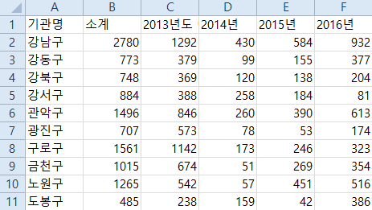
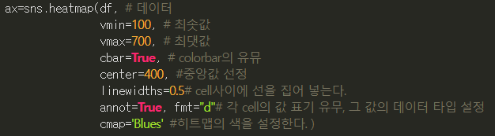

# 데이터

# 01 시작하기

* `import pandas as pd`

## pandas

### 파일 읽어오기

* `read_csv` : csv 파일을 읽는 명령어



* `columns` : pandas에서 데이터의 첫 줄은 해당 열을 대표하는 일종의 제목
  * `<dataname>.columns` 와 같이 사용해 columns 의 이름 반환 가능

* `<dataname>.rename(columns={<dataname>.columns[0] : ''}, inplace=True)`
  * CSV 파일의 내용을 바꿀 수 있음
  * 딕셔너리 모양으로 지정하게 됨
* `var = pd.read_excel('../data/01.xls', header = 2, usecols = 'B, D, G, J, N')`
  * excel 파일의 3번째 줄(2번 인덱스) 부터, BDGJN열을 읽어옴
  * 위와 유사하게 `.rename()`이 동작 


### 판다스 기초

* `pd.Series([lst])`판다스의 가장 기초 데이터 유형
* `pd.DataFrame(list_like, index=[], columns=[])`
  * 개념적으로, 시리즈들을 하나의 열로 취급한 집합
  * 데이터를 표의 형태로 처리함
  * `.describe()`, `.sort_values(by='colname')` 등의 처리 가능
  * `.head(n)` `df[n:k]` 등으로 위에서부터 n 행, 중간 n행부터 k행까지 보기 가능
    * 파이썬의 list slicing과 유사하지만 끝번호를 포함
  * `df['colname']` 으로 원하는 열을 Series 형태로 확인 가능


* loc
  * `df.loc[datelist[idx]]` 와 같이 사용해 특정 인덱스의 값들을 볼 수도 있음
  * `df.loc[:, ['A', 'B']]` 처럼 사용하면 모든 인덱스, A, B 콜럼의 값을 볼수 있음


* iloc
  * `df.iloc[idx]` 인덱스, 콜럼의 값이 아닌 번호로 접근 가능
  * `df.iloc[:, :]` 과 같이 범위로 슬라이싱도 가능
  * `df[df.A > 0]` (`df[df['A'] > 0]`와 동일) 처럼 특정 조건을 만족하는 행만 볼수도 있음
  * `df[df > 0]` 데이터 전체에 조건을 걸면 만족하지 않는 곳을 NaN처리하고 모두 출력
  * `df['E'] = [1, 2, 3, 4, 5, 6]` 새로운 컬럼의 추가, 기존 컬럼의 수정은 이렇게


### 판다스에서 두 데이터 프레임 병합하기

#### `concat`

* 아무 옵션 없이 사용하면 열 방향으로 쭉 합침
  * `result = pd.concat([df1, df2, df3])`
* key 를 지정하면 레벨이 있는 다중 인덱스를 갖는 자료가 됨
  * `result = pd.concat([df1, df2, df3], keys = ['x', 'y', 'z'])`
  * x, y, z 는 level 0, df 의 원래 인덱스들은 level 1 을 가짐
* 옵션 axis = 1 은 인덱스를 기준으로 합쳐짐
  * result = pd.concat([df1, df4], axis=1)
  * 각 df에서 인덱스에 해당하는 값이 없는 경우, NaN을 가짐
* join='inner'
  * 공통 인덱스만 합치는 기능
* .reindex(df1.index)
  * df1의 인덱스에 맞추어 병합하는 기능
* ignore_index=True
  * 각 df의 인덱스를 무시하고 열을 기준으로 병합 후 새 인덱스 부여


#### merge

* 공통 컬럼을 기준으로 합칠수있음
  * `pd.merge(df1, df2, on='colname')`
  * 두 데이터에서 colname 열 중 공통된 값을 기준으로 병합됨
* `how = df1` `how = df2` `how = outer`
  * 기준으로 삼을 colname 열 값을 어디로 할 건지 정할 수 있음
  * df1 기준으로 병합 시, df2 에 해당 값이 없다면 NaN 을 가짐
  * outer 의 경우, 합집합 꼴로 병합

* 그래프 등의 조작을 위해 인덱스 설정하기
  * `.set_index('colname', inplace=True)`


### 상관계수

#### 1. np.corrcoef

* 넘파이

#### 2. df[['col1', 'col2']].corr()

* 판다스의 데이터프레임 형태로 반환
* 보기 편함


## 시각화

[참고](https://matplotlib.org/stable/api/_as_gen/matplotlib.pyplot.plot.html)

### matplotlib

`import matplotlib.pyplot as plt`

* DataFrame.plot(kind=' ', grid = , )...
  * kind 는 bar, pie, box, scatter 등의 값을 가짐
  * plot.bar 처럼 사용도 가능


### scatter

```python
# scattor 함수 써보기 1
plt.figure(figsize=(6,6))
plt.scatter(data_result['인구수'], data_result['소계'], s = 50)
plt.xlabel('인구수')
plt.ylabel('CCTV')
plt.grid()
```

```python
# 2
plt.plot(
    '인구수',
    '소계',
    data = data_result,
    markersize = 50,
    linestyle= 'none'
)

#3
data_result.plot(x='인구수', y='소계', kind='scatter', grid=True, figsize=(6, 6))
```

* 위에게 훨씬 편한듯
* 산점도 그래프???
  * [산점도 그래프](https://ko.wikipedia.org/wiki/%EC%82%B0%EC%A0%90%EB%8F%84)


### 데이터 가공(np.polyfit)

* 솔직히 수학적 이야기들은 잘 모르겠음
* 노이즈가 있는 자료에서 평균 선을 찾는 역할을 한다 함
* `fp = np.polyfit(data_result['인구수'], data_result['소계'], 1)`
  * 마지막 1은 찾고자 하는 그래프의 차수
* `f1 = np.poly1d(fp)`
  * f1 은 poly1d 의 결과를 함수로 받음
  * 즉, f1(fp) 처럼 사용해야 plot 의 y값으로 사용할 수 있음


### 오차 범위에 대한 분석 추가

```python
data_result['오차'] = np.abs(data_result['소계'] - f1(data_result['인구수']))
df_sort = data_result.sort_values(by='오차', ascending=False)
```

* 새 열을 추가해 오차범위가 큰 순서대로 위에서 뽑고자 함
* `plt.scatter(data_result['인구수'], data_result['소계'], c=data_result['오차'], s = 50)`
  * c : 뒤의 데이터값을 이용해 오차에 따라 마커의 색상이 변화함


* `plt.text`
  * 추가할 텍스트의 x좌표, y좌표, 텍스트 를 값으로 가짐


* ```python
  for n in range(10):
      plt.text(df_sort['인구수'][n], df_sort['소계'][n], df_sort.index[n], fontsize=15)
  ```
  * 오차가 큰 곳 10 곳에 마커 추가하기
  
  * ```python
    # cannot convert the series to <class 'float'>
    for n in range(10):
        plt.text(df_sort['인구수'][n], df_sort['소계'], df_sort.index[n], fontsize=15)
    ```
  
  * 에러가 났던 코드, 왜 시리즈를 변환하는지 한참 고민했었는데 `df_sort['소계']` 에 인덱스를 주지 않아서 콜럼을 그대로 받아와서 그랬던 것


# 02

## 시작하기

* `pd.read_csv('../../data/02. crime_in_Seoul.csv', thousands=',', encoding='euc-kr')`
  * 폴더 위치가 옮겨서 2개 상위폴더에서 찾아가야함
  * `thousands=','` 천단위 구분자 , 를 없애고 정수형으로 받기

### 파일 가공하기

* json 파일 가공하는것과 유사함
* `.loc[[df['index']], ['colname']] = 'newname'`
  * .loc 를 사용해 하나의 예외사항에 대한 처리가 가능

### 파일 저장하기

* `.to_csv('./filename.csv', sep=',', encoding='utf-8')`
  * sep: csv의 구분자 설정, 기본으로 콤마임


## 피봇 테이블

* `.pivot_table(df, index=['name'])`
  * 'name' 컬럼이 인덱스가 됨
  * 특별히 지정하지 않으면 숫자형 데이터 컬럼이 남고, name 컬럼에 중복되는 행이 있었다면 하나로 합쳐지고 숫자는 평균값을 가짐
  * aggfunc=[np.sum, np.mean] 과 같이 평균값 대신 원하는 산식을 넣을 수 있음
    * np.sum 과 sum은 동일한 결과를 반환하지만 np.sum의 속도가 더 빠르다(???)
  * 


### 처리하기

* 여러  콜럼의 값을 합하고 싶을 때

  * ```python
    col = ['a','b','c','d']
    np.sum(df[col], axis=1)
    ```

  * 


## 또다른 시각화

### seaborn

* matplotlib 와 함께 사용
* seaborn 을 import 할 땐 matplotlib 도 import 되어있어야 함
* seaborn 을 임포트하면 색상 등을 matplot이 아닌 seaborn의 것을 따름
* seaborn.boxplot(x='colname1', y='colname2', data=df) 와 같은 형태의 그래프도 가능
* hue='colname3' 옵션을 통해 박스플롯의 각 막대를 다시 구분하는것도 가능
* seaborn.heatmap
  * 

* seborn.pairplot(DF, hue='colname')
  * hue 의 카테고리에 대해 다차원 요소에 대한 그래프를 그려줌
  * 같은 데이터가 만나는 영역(대각선) 에는 해당 데이터의 히스토그램(도수분포의 그래프형) 을 그림
