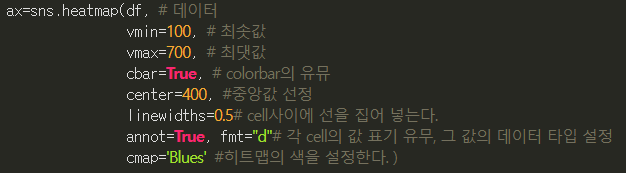

# 02

## 시작하기

* `pd.read_csv('../../data/02. crime_in_Seoul.csv', thousands=',', encoding='euc-kr')`
  * 폴더 위치가 옮겨서 2개 상위폴더에서 찾아가야함
  * `thousands=','` 천단위 구분자 , 를 없애고 정수형으로 받기

### 파일 가공하기

* json 파일 가공하는것과 유사함
* `.loc[[df['index']], ['colname']] = 'newname'`
  * .loc 를 사용해 하나의 예외사항에 대한 처리가 가능

### 파일 저장하기

* `.to_csv('./filename.csv', sep=',', encoding='utf-8')`
  * sep: csv의 구분자 설정, 기본으로 콤마임


## 피봇 테이블

* `.pivot_table(df, index=['name'])`
  * 'name' 컬럼이 인덱스가 됨
  * 특별히 지정하지 않으면 숫자형 데이터 컬럼이 남고, name 컬럼에 중복되는 행이 있었다면 하나로 합쳐지고 숫자는 평균값을 가짐
  * aggfunc=[np.sum, np.mean] 과 같이 평균값 대신 원하는 산식을 넣을 수 있음
    * np.sum 과 sum은 동일한 결과를 반환하지만 np.sum의 속도가 더 빠르다(???)
  * 


### 처리하기

* 여러  콜럼의 값을 합하고 싶을 때

  * ```python
    col = ['a','b','c','d']
    np.sum(df[col], axis=1)
    ```

  * 


## 또다른 시각화

### seaborn

* matplotlib 와 함께 사용
* seaborn 을 import 할 땐 matplotlib 도 import 되어있어야 함
* seaborn 을 임포트하면 색상 등을 matplot이 아닌 seaborn의 것을 따름
* seaborn.boxplot(x='colname1', y='colname2', data=df) 와 같은 형태의 그래프도 가능
* hue='colname3' 옵션을 통해 박스플롯의 각 막대를 다시 구분하는것도 가능
* seaborn.heatmap
  * 

* seborn.pairplot(DF, hue='colname')
  * hue 의 카테고리에 대해 다차원 요소에 대한 그래프를 그려줌
  * 같은 데이터가 만나는 영역(대각선) 에는 해당 데이터의 히스토그램(도수분포의 그래프형) 을 그림