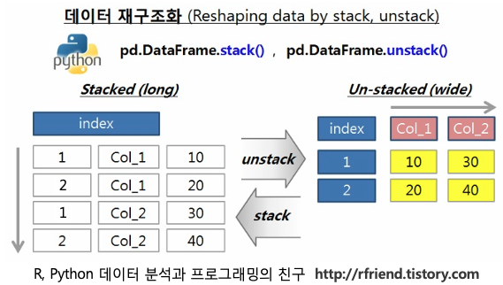
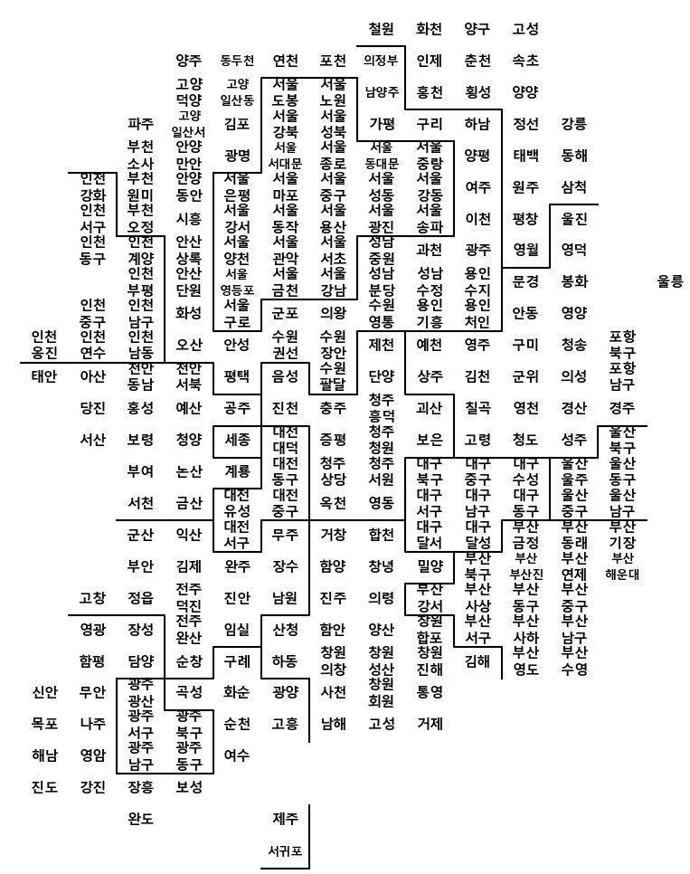

# 05 대한민국 인구

## 목표

* 20 - 39 세 여성 인구화 65세 이상 인구 비율 비교를 통해 인구 소멸 위기 지역 찾아보기


## 데이터 읽기

* ```python
  population = pd.read_excel('../../data/05. population_raw_data.xlsx', header = 1)
  
  population.fillna(method = 'pad', inplace = True)
  ```

* fillna : 결측값 (None, NaN) 채우는 방법을 정함

  * fillna(0)으로 특정 값으로
  * method = 'ffill'/'pad' 로 앞의 값으로, 'bfill'/'backfill' 로 뒤의 값으로 채우게 됨


## 데이터 정리

* ```python
  population.rename(columns = {'행정구역(동읍면)별(1)':'광역시도', '행정구역(동읍면)별(2)':'시도', '계':'인구수'}, inplace = True)
  population = population[population['시도'] != '소계']
  
  population.rename(columns = {'항목': '구분'}, inplace = True)
  population.loc[population['구분'] == '총인구수 (명)', '구분'] = '합계'
  population.loc[population['구분'] == '남자인구수 (명)', '구분'] = '남자'
  population.loc[population['구분'] == '여자인구수 (명)', '구분'] = '여자'
  ```

* rename 을 통해 원하는 형태로 변환


## 원하는 값 찾기

* ```python
  population['20-39세'] = population['20 - 24세'] + population['25 - 29세']...
  population['65세이상'] = population['65 - 69세'] + population['70 - 74세']...
  
  pop = pd.pivot_table(population, index = ['광역시도', '시도'], columns = ['구분'], values = ['인구수', '20-39세', '65세이상'])
  pop['소멸비율'] = pop['20-39세', '여자'] / (pop['65세이상', '합계'] / 2)
  pop['소멸위기지역'] = pop['소멸비율'] < 1.0
  ```

* 피봇 테이블을 이용해 원하는 값만 테이블로 생성

* 목표에 따라 원하는 값 계산


## 테이블 정리

* ```python
  # 인덱스 통합
  pop.reset_index(inplace=True)
  
  # 컬럼 통합
  tmp_columns = [pop.columns.get_level_values(0)[n] + pop.columns.get_level_values(1)[n] for n in range(0, len(pop.columns.get_level_values(0)))]
  pop.columns = tmp_columns
  ```


## 시각화를 위한 ID작업

* ```python
  for n in pop.index:
      if pop['광역시도'][n][-3:] not in ['광역시', '특별시', '자치시']:
          if pop['시도'][n][:-1]=='고성' and pop['광역시도'][n]=='강원도':
              si_name[n] = '고성(강원)'
          elif pop['시도'][n][:-1]=='고성' and pop['광역시도'][n]=='경상남도':
              si_name[n] = '고성(경남)'
          else:
               si_name[n] = pop['시도'][n][:-1]
                  
          for keys, values in tmp_gu_dict.items():
              if pop['시도'][n] in values:
                  if len(pop['시도'][n])==2:
                      si_name[n] = keys + ' ' + pop['시도'][n]
                  elif pop['시도'][n] in ['마산합포구','마산회원구']:
                      si_name[n] = keys + ' ' + pop['시도'][n][2:-1]
                  else:
                      si_name[n] = keys + ' ' + pop['시도'][n][:-1]
          
      elif pop['광역시도'][n] == '세종특별자치시':
          si_name[n] = '세종'
          
      else:
          if len(pop['시도'][n])==2:
              si_name[n] = pop['광역시도'][n][:2] + ' ' + pop['시도'][n]
          else:
              si_name[n] = pop['광역시도'][n][:2] + ' ' + pop['시도'][n][:-1]
  ```

* 파이썬에서 늘 사용하던 방법 그대로 예외처리가 가능


## DROP

* ```python
  df.drop(index = [0, 1], inplace = True)
  df2 = df.drop(index = [0, 1])
  df.drop(['colname'], axis = 1, inplace = True)
  df4 = df.drop(column = ['colname'])
  df5 = df[df['colname'] == 'case']
  pop = pop.drop(pop[pop['ID'] == tmp].index)
  ```

* 드롭의 사용 방법 다시 한 번 정리

* column, index 표기를 안쓰려면 axis 설정을 해줘야 함

* 원본에서 바로 바꾸려면 inplace = True 필요

* 조건을 만족시키는 인덱스를 지우기 위해 [조건].index 로 드롭도 가능


## stack()

* 


## 지도 그리기

* ```python
  draw_korea_raw = pd.read_excel('../../data/05. draw_korea_raw.xlsx')
  draw_korea_raw_stacked = pd.DataFrame(draw_korea_raw.stack())
  draw_korea_raw_stacked.reset_index(inplace = True)
  draw_korea_raw_stacked.rename(columns = {'level_0' : 'y', 'level_1' : 'x', 0: 'ID'}, inplace = True)
  draw_korea = draw_korea_raw_stacked
  
  BORDER_LINES = [
      [(5, 1), (5,2), (7,2), (7,3), (11,3), (11,0)], # 인천
      [(5,4), (5,5), (2,5), (2,7), (4,7), (4,9), (7,9), 
       (7,7), (9,7), (9,5), (10,5), (10,4), (5,4)], # 서울
      ...
  ]
  plt.figure(figsize=(8, 11))
  
  # 지역 이름 표시
  for idx, row in draw_korea.iterrows():
      
      # 광역시는 구 이름이 겹치는 경우가 많아서 시단위 이름도 같이 표시한다. 
      # (중구, 서구)
      if len(row['ID'].split())==2:
          dispname = '{}\n{}'.format(row['ID'].split()[0], row['ID'].split()[1])
      elif row['ID'][:2]=='고성':
          dispname = '고성'
      else:
          dispname = row['ID']
  
      # 서대문구, 서귀포시 같이 이름이 3자 이상인 경우에 작은 글자로 표시한다.
      if len(dispname.splitlines()[-1]) >= 3:
          fontsize, linespacing = 9.5, 1.5
      else:
          fontsize, linespacing = 11, 1.2
  
      plt.annotate(dispname, (row['x']+0.5, row['y']+0.5), weight='bold',
                   fontsize=fontsize, ha='center', va='center', 
                   linespacing=linespacing)
      
  # 시도 경계 그린다.
  for path in BORDER_LINES:
      ys, xs = zip(*path)
      plt.plot(xs, ys, c='black', lw=1.5)
  
  plt.gca().invert_yaxis()
  #plt.gca().set_aspect(1)
  
  plt.axis('off')
  
  plt.tight_layout()
  plt.show()
  ```

* 


## 두 개의 DF를 합치기 위해

* ```python
  tmp_lst = list((set(pop['ID'].unique()) - set(draw_korea['ID'].unique())))
  
  for tmp in tmp_lst:
      pop = pop.drop(pop[pop['ID'] == tmp].index)
  ```

* 이런식으로 차집합 연산을 이용해 두 데이터프레임에서 겹치지 않는 걸 제거할 수 있다

