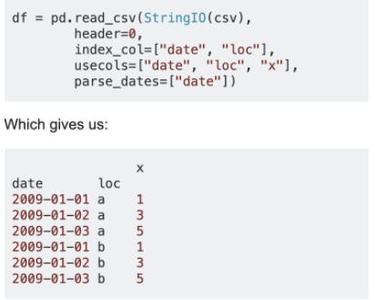
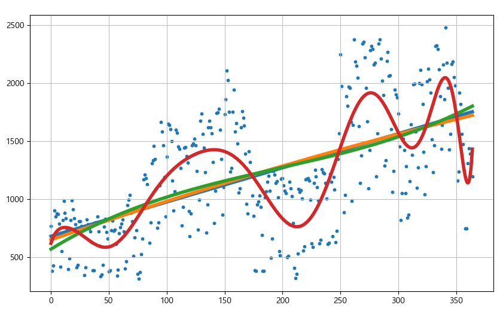
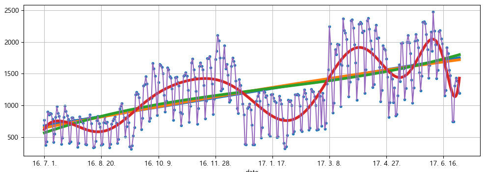
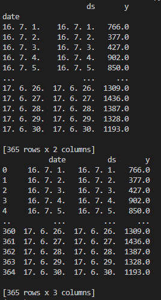
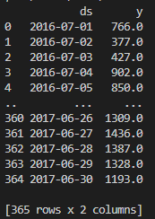
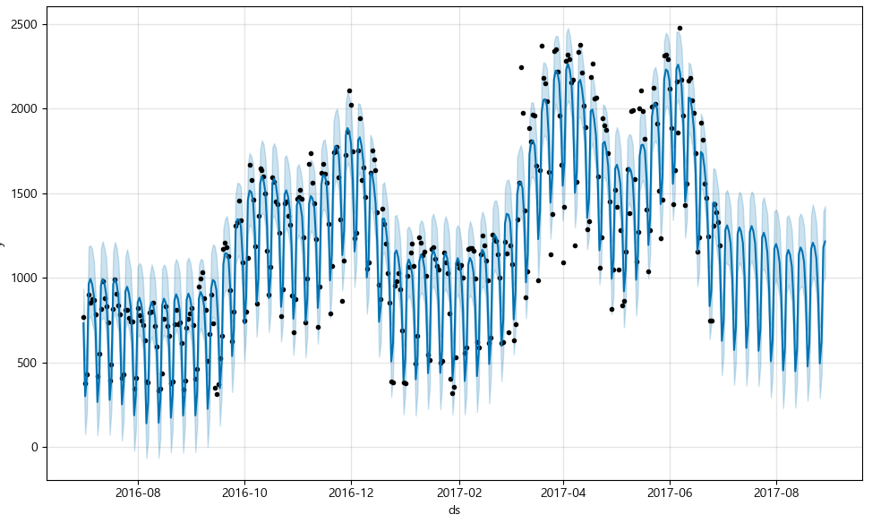
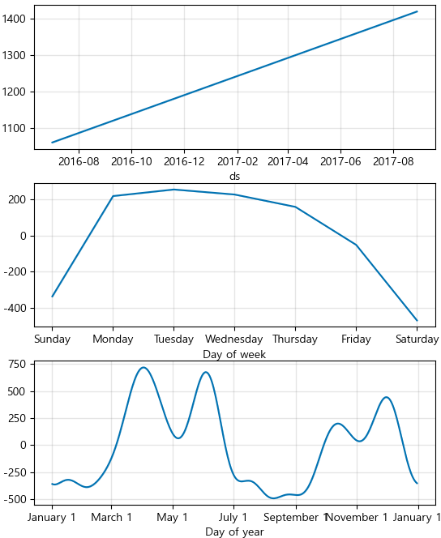
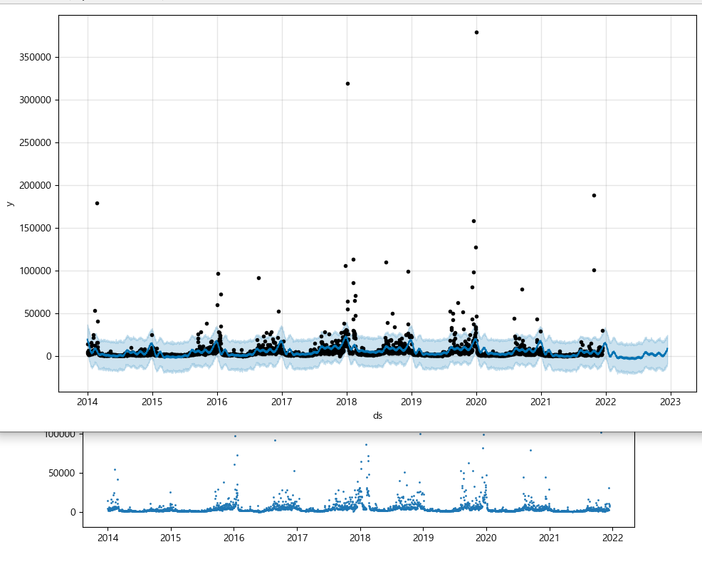

# 시계열 데이터

## [참고](https://predictor-ver1.tistory.com/4)

## 시작하기

> 파이썬 버전을 낮춘 가상 환경에서 진행됨

* 

* [출처](https://stackoverflow.com/questions/15017072/pandas-read-csv-and-filter-columns-with-usecols)

* ```python
  pinkwink_web = pd.read_csv('../../data/08. PinkWink Web Traffic.csv', encoding = 'UTF-8', thousands = ',', names = ['date', 'hit'], index_col = 0)
  pinkwink_web = pinkwink_web[pinkwink_web['hit'].notnull()]
  
  # arange 를 통해 구간을 스텝 단위로 나눈 리스트 받기
  time = np.arange(0, len(pinkwink_web))
  traffic = pinkwink_web['hit'].values
  fx = np.linspace(0, time[-1], 1000)
  ```


## N차식 모델 만들기

* ```python
  def error(f, x, y):
      return np.sqrt(np.mean((f(x) - y)**2))
  
  fp1 = np.polyfit(time, traffic, 1)
  f1 = np.poly1d(fp1)
  
  f2p = np.polyfit(time, traffic, 2)
  f2 = np.poly1d(f2p)
  
  f3p = np.polyfit(time, traffic, 3)
  f3 = np.poly1d(f3p)
  
  f15p = np.polyfit(time, traffic, 15)
  f15 = np.poly1d(f15p)
  ```

### [polyfit 과 poly1d](https://pinkwink.kr/1127)

* polyfit : 3번째 인자로 넣은 차수의 계수를 찾아줌
* poly1d: x^n, ... , x^0 의 계수를 갖는 다항식으로 취급됨
  * 즉 `np.poly1d([1,1]) * np.poly1d([1,-1])` 의 결과는 `poly1d[1, 0, -1]`과 같음
  * 또, 위의 에러 함수에서처럼 코드에서 함수로 사용할 수도 있음

* 

* 

### 과적합?


## forecast 예측

### DataFrame

* 이 때 columns 이름을 시간은 ds, 데이터는 y로 지정해주어야 한다

* ```python
  df = pd.DataFrame({'ds': pinkwink_web.index, 'y': pinkwink_web['hit']})
  print(df)
  df.reset_index(inplace = True)
  print(df)
  df['ds'] = pd.to_datetime(df['ds'], format = '%y. %m. %d.')
  df.drop(['date'], axis = 1, inplace = True)
  print(df)
  ```

* 


### 예측

* ```python
  # 연 단위의 주기성을 갖는다는 정보
  m = Prophet(yearly_seasonality = True)
  m.fit(df)
  
  # 앞으로 60일간의 정보에 대한 데이터프레임 만들기
  future = m.make_future_dataframe(periods = 60)
  forecast = m.predict(future)
  forecast[['ds', 'yhat', 'yhat_lower', 'yhat_upper']]
  m.plot(forecast)
  plt.show()
  ```

* 

* 2017/06 이후 60일치의 그래프가 예측되어 생성됨

* ```python
  m.plot_components(forecast)
  ```

* 

* 연습용 그래프
* 


